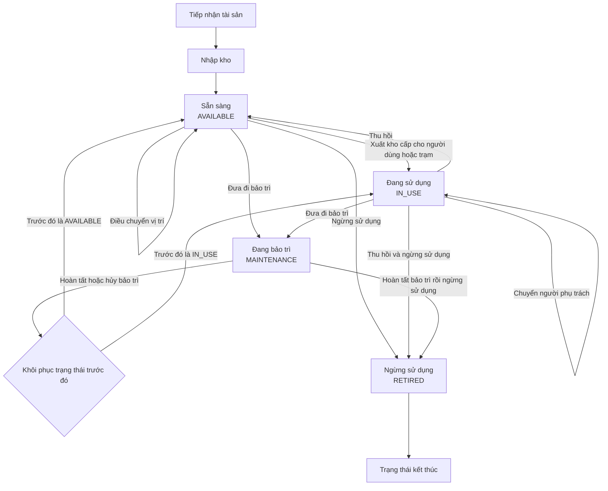

# Vòng đời tài sản

## Sơ đồ tổng quan

## Các bước trong vòng đời

1. **Tiếp nhận và nhập kho**
   - Tạo hồ sơ tài sản.
   - Ghi nhận kho, vị trí và người thực hiện.
   - Phát sinh sự kiện `RECEIVED`.
   - Trạng thái: `AVAILABLE` - Sẵn sàng.

2. **Cấp phát**
   - Xuất tài sản khỏi kho cho người dùng hoặc trạm.
   - Ghi nhận người nhận, vị trí và ngày bàn giao.
   - Phát sinh sự kiện `ISSUED`.
   - Trạng thái: `IN_USE` - Đang sử dụng.

3. **Điều chuyển hoặc đổi người phụ trách**
   - Điều chuyển chỉ thay đổi vị trí.
   - Đổi người phụ trách lưu cả người cũ và người mới.
   - Trạng thái sử dụng không thay đổi.

4. **Thu hồi**
   - Kết thúc cấp phát hiện tại.
   - Đưa tài sản về kho.
   - Phát sinh sự kiện `RETURNED`.
   - Trạng thái trở về `AVAILABLE`.

5. **Bảo trì**
   - Tài sản chuyển sang `MAINTENANCE`.
   - Không được xuất kho khi đang có đợt bảo trì mở.
   - Khi hoàn tất hoặc hủy bảo trì, trạng thái được khôi phục về `AVAILABLE` hoặc `IN_USE`.

6. **Ngừng sử dụng**
   - Phải thu hồi người phụ trách và kết thúc bảo trì trước.
   - Đóng vị trí hiện tại và loại khỏi tồn kho.
   - Phát sinh sự kiện `RETIRED`.
   - Đây là trạng thái kết thúc; tài sản không thể cấp phát, điều chuyển hoặc nhập lại kho.

## Lịch sử tài sản

Toàn bộ thao tác được lưu trong **History** dưới dạng timeline bất biến, gồm:

- Nhập và xuất kho
- Cấp phát và thu hồi
- Điều chuyển vị trí
- Chuyển người phụ trách
- Bảo trì
- Cập nhật thông tin
- Ngừng sử dụng

## Cách xem trong VS Code

Mở file này, sau đó nhấn `Ctrl+Shift+V` để mở Markdown Preview.
