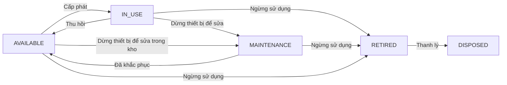

# Vòng đời tài sản

## Bộ trạng thái duy nhất

| Mã | Hiển thị | Ý nghĩa |
| --- | --- | --- |
| `AVAILABLE` | Sẵn sàng | Có thể cấp phát, đưa vào sử dụng |
| `IN_USE` | Đang sử dụng | Đang sử dụng tại trạm hoặc được cấp cho người dùng |
| `MAINTENANCE` | Đang bảo trì | Đang sửa chữa/bảo trì, không được cấp phát |
| `RETIRED` | Hư / Ngừng sử dụng | Không tiếp tục sử dụng; có thể thanh lý |
| `DISPOSED` | Đã thanh lý | Kết thúc vòng đời, không quay lại sử dụng |

Không dùng trạng thái để mô tả lỗi. Vấn đề, chẩn đoán, cách xử lý, linh kiện và kết quả nằm trong phiếu bảo trì/sửa chữa.

```mermaid
flowchart LR
    A[AVAILABLE] -->|Cấp phát| U[IN_USE]
    U -->|Dừng thiết bị để sửa| M[MAINTENANCE]
    M -->|Đã khắc phục| A
    U -->|Ngừng sử dụng| R[RETIRED]
    M -->|Ngừng sử dụng| R
    R -->|Thanh lý| D[DISPOSED]
    U -->|Thu hồi| A
    A -->|Dừng thiết bị để sửa trong kho| M
    A -->|Ngừng sử dụng| R
```

Ba đường bổ sung giữ tương thích Asset Operations hiện có: thu hồi `IN_USE → AVAILABLE`, bảo trì thiết bị sẵn sàng `AVAILABLE → MAINTENANCE`, ngừng sử dụng thiết bị trong kho `AVAILABLE → RETIRED`. Chuyển người phụ trách và điều chuyển vị trí không tự đổi trạng thái.

## Tạo tài sản và nhập Excel

- Form Status bắt buộc, được chọn đúng 5 trạng thái, mặc định `AVAILABLE`. Có thể xóa lựa chọn nhưng không lưu được khi trống.
- API sử dụng `status_id` hiện có, kiểm tra đúng danh mục và không ghi đè lựa chọn. Bỏ hẳn trường này dùng `AVAILABLE` để tương thích client cũ; `null` và chuỗi rỗng bị từ chối.
- Excel có cột Trạng thái (`status`), nhận đúng các mã phía trên. Thiếu cột hoặc để trống dùng `AVAILABLE`; trạng thái không hợp lệ hủy toàn bộ lượt nhập.
- Việc tạo hồ sơ là khởi tạo trạng thái hiện tại, không phải chuyển trạng thái của tài sản đang tồn tại. Được ghi `RECEIVED` với trạng thái ban đầu và người nhập.
- `AVAILABLE` / `MAINTENANCE` / `RETIRED` nhận vào kho. Khi khởi tạo hồ sơ đang sử dụng, hệ thống vẫn giữ vị trí tiếp nhận nhưng không đánh dấu còn trong kho và không tự tạo cấp phát. Hồ sơ đã thanh lý không còn vị trí hiện tại.

## Các thao tác

- **Xuất kho:** chỉ `AVAILABLE`; record vấn đề đang mở không tự chặn thiết bị vẫn sử dụng được. Chọn người nhận hoặc trạm, chuyển `IN_USE`, ghi một sự kiện `ISSUED`.
- **Thu hồi:** đóng cấp phát và nhập về kho, mặc định `AVAILABLE`. Chỉ chọn `AVAILABLE`, `MAINTENANCE` hoặc `RETIRED`; không đánh dấu tài sản trong kho đang sử dụng và không bỏ qua bước thanh lý. RETURN về AVAILABLE hoàn tất phiếu xử lý đang mở trong cùng giao dịch; RETURN về MAINTENANCE giữ phiếu mở để tiếp tục sửa. Ghi một sự kiện `RETURNED`; thu hồi `RETIRED` vẫn giữ vị trí kho để quản lý tài sản chờ thanh lý.
- **Bảo trì:** ghi nhận vấn đề không tự đổi trạng thái Asset. Chỉ thao tác “Dừng thiết bị để sửa” chuyển `MAINTENANCE`, giữ nguyên Station/Assignee. Hoàn tất với kết quả Đã khắc phục chuyển `AVAILABLE`; Không khắc phục được chuyển `RETIRED` (Hư / Ngừng sử dụng). Kết thúc cấp phát, giữ vị trí/kho. Phiếu hoàn tất không được chỉnh sửa. Xem [Maintenance flow](docs/maintenance-flow.md).
- **Ngừng sử dụng:** áp dụng cho `AVAILABLE`, `IN_USE`, `MAINTENANCE`. Kết thúc cấp phát, đóng phiếu bảo trì mở với kết quả/nguyên nhân lưu trong phiếu, giữ nguyên vị trí và kho cho đến khi thanh lý trong cùng giao dịch. Ghi một sự kiện `RETIRED`.
- **Thanh lý:** chỉ từ `RETIRED`, bắt buộc lý do. Đóng vị trí kho còn lại nếu có, chuyển `DISPOSED`, ghi một sự kiện `DISPOSED`. Chặn cấp phát, điều chuyển, thu hồi, bảo trì và thanh lý lần hai.
- Không sửa trực tiếp trạng thái qua PATCH tài sản; phải dùng thao tác nghiệp vụ để đồng bộ kho, cấp phát, bảo trì và lịch sử.

## Asset History

Chín loại sự kiện: `RECEIVED`, `ISSUED`, `RETURNED`, `MOVED`, `REASSIGNED`, `MAINTENANCE`, `RETIRED`, `DISPOSED`, `UPDATED`.

Mỗi thao tác tạo một sự kiện trong cùng transaction, chứa trạng thái trước/sau, thời gian và người thực hiện. Bảng lịch sử hiển thị `Old Status → New Status`; popup giữ chi tiết vị trí, người phụ trách, thay đổi và liên kết phiếu bảo trì. Không tạo sự kiện trạng thái trùng với sự kiện nghiệp vụ.

## Chuyển dữ liệu cũ

Migration `0007` chuẩn hóa `REPAIR_NEEDED`, `BROKEN`, `DAMAGED`, `WAITING_REPAIR` về `MAINTENANCE`; không tự kết luận thiết bị phải bỏ chỉ dựa trên nhãn lỗi. `RETIRED` được giữ nguyên. Chuẩn hóa cả `status_id`, trạng thái trước bảo trì và trạng thái trong snapshot sự kiện; giữ nội dung lỗi/sửa chữa, actor, thời gian và audit gốc.

Danh mục dư được lưu trữ, không còn là lựa chọn hoạt động; giữ bản ghi để không phá liên kết lịch sử. Database giới hạn `current_status` bằng CHECK (database mới/PostgreSQL) hoặc trigger tương đương (SQLite nâng cấp). Sao lưu trước `alembic upgrade head`. Không downgrade làm mất bằng chứng lịch sử; khôi phục bản sao lưu nếu cần quay lại phiên bản cũ.

Migration `0008` tách Maintenance khỏi Ticket và chuyển danh mục loại bảo trì thành nhóm vấn đề; giữ tham chiếu/loại cũ trong ghi chú, không thay đổi trạng thái Asset.
