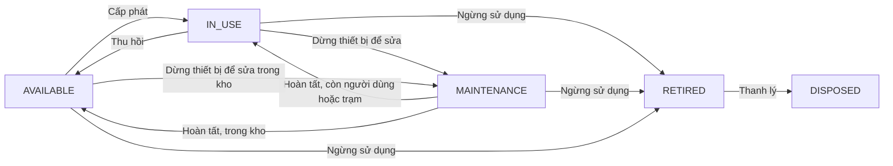
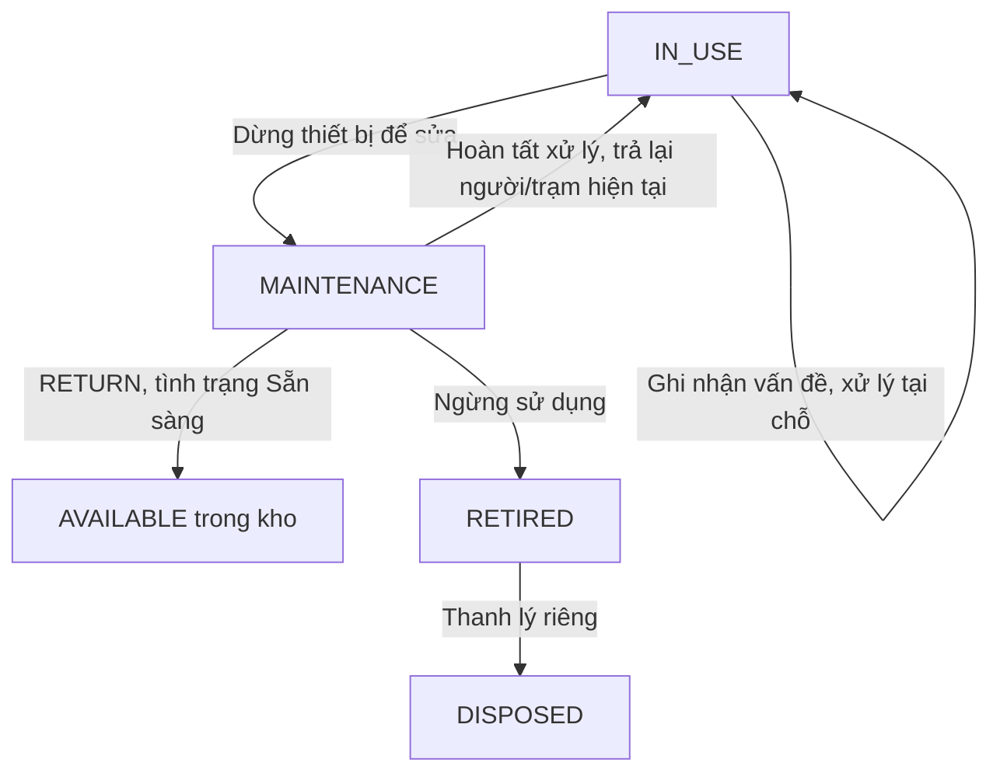

# Nghiệp vụ hiện tại — IT Helpdesk / Quản lý tài sản CNTT

Ngày xuất: 27/09/2026. Phạm vi: mã nguồn hiện tại sau refactor Maintenance, mốc schema 0008. Đây là mô tả **as-is**, không phải đề xuất tính năng hoặc bản sao dữ liệu vận hành.

## 1. Mục tiêu và phạm vi

Hệ thống quản lý vòng đời tài sản CNTT, nơi đặt thiết bị, người sử dụng, nhập/xuất/thu hồi kho, vật tư, quá trình sửa chữa và cấu hình mạng. Đối tượng sử dụng là đội IT và người có quyền xem dữ liệu nội bộ.

Ba khái niệm tách biệt: **Asset Status** phản ánh khả năng vận hành; **Maintenance** ghi vấn đề và quá trình xử lý; **Asset Operations** thực hiện tiếp nhận, cấp phát, thu hồi và điều chuyển. Vị trí, người sử dụng và kho không phải trạng thái thiết bị.

## 2. Các phân hệ

| Phân hệ | Nghiệp vụ đang có | Lưu ý |
| --- | --- | --- |
| Tổng quan | Thống kê tài sản theo trạng thái, loại, vị trí; tồn kho thấp; phiếu mở; hoạt động gần nhất | Dashboard là số liệu hiện tại, không phải báo cáo khấu hao. |
| Tài sản | Hồ sơ thiết bị có số sê-ri, loại, model, ảnh/QR; cấp phát, điều chuyển, ngừng sử dụng, thanh lý; lịch sử | Khả năng quản lý vị trí, người dùng, mạng, bảo trì và cổng phụ thuộc cấu hình loại tài sản. |
| Kho | Quản lý kho; tiếp nhận tài sản; xuất cho người/trạm; thu hồi về kho | Thiết bị có sê-ri giao dịch từng chiếc; tách trạng thái vận hành và vị trí kho. |
| Tồn kho / Vật tư | Xem tài sản trong kho, số lượng vật tư và lịch sử nhập xuất | Vật tư theo số lượng; xuất không vượt tồn; không sửa số dư trực tiếp. |
| Trạm / Vị trí | Cấu trúc địa điểm–đơn vị–trạm; trạm hoạt động/ngừng hoạt động; thông tin vị trí | Station và người nhận là hai thông tin độc lập. |
| Bảo trì | Ghi nhận vấn đề, chẩn đoán, xử lý, người thực hiện, thời gian và chi phí | Độc lập Ticket; không tự thu hồi hoặc xóa người/trạm khi dừng sửa. |
| Mạng / IPAM | Interface, IP, subnet, VLAN, cổng switch và liên kết thiết bị | Quản lý dữ liệu mạng đã nhập; chưa phải chức năng tự khám phá mạng. |
| Kho kiến thức | Bài viết Markdown; phân loại; nháp, xuất bản, lưu trữ | Lưu hướng dẫn và tri thức; không thay thế phiếu bảo trì. |
| Báo cáo | Lọc, nhóm và xuất dữ liệu tài sản, cấp phát, IP, subnet, cổng switch, bảo trì, bài viết, lịch sử vị trí | Xuất CSV/XLSX theo khả năng màn hình/API; danh sách tài sản có xuất XLSX. |
| Cấu hình / Người dùng | Loại tài sản và khả năng; danh mục; tài khoản và vai trò; audit | Chỉ quản trị viên sửa người dùng, loại tài sản, danh mục và vị trí. |

## 3. Vai trò và quyền

Quyền ghi dưới đây áp dụng cùng điều kiện trạng thái và cấu hình loại tài sản. Vai trò không đồng nghĩa được bỏ qua validation. Người xem không được thực hiện thay đổi; quản lý tài khoản dành riêng ADMIN. Lưu trữ/xóa có ràng buộc riêng và không nên suy ra từ quyền sửa.

| Thao tác | ADMIN | IT_MANAGER | IT_SUPPORT | VIEWER |
| --- | --- | --- | --- | --- |
| Xem các phân hệ nghiệp vụ | Có | Có | Có | Có |
| Tạo/sửa hồ sơ tài sản | Có | Có | Không | Không |
| Nhập kho, xuất kho, thu hồi; vật tư | Có | Có | Không | Không |
| Cấp phát ngoài kho, chuyển người, điều chuyển | Có | Có | Có | Không |
| Ghi nhận và xử lý bảo trì, dừng thiết bị | Có | Có | Có | Không |
| Ngừng sử dụng, thanh lý | Có | Có | Có | Không |
| Cấu hình mạng / IPAM | Có | Có | Không | Không |
| Tạo/sửa bài viết kiến thức | Có | Có | Có | Không |
| Sửa danh mục, loại tài sản, vị trí/trạm | Có | Không | Không | Không |
| Quản lý tài khoản và vai trò | Có | Không | Không | Không |

## 4. Vòng đời tài sản

| Mã đối chiếu | Nhãn giao diện | Ý nghĩa |
| --- | --- | --- |
| AVAILABLE | Sẵn sàng | Có thể đưa vào sử dụng/cấp phát |
| IN_USE | Đang sử dụng | Thiết bị đang sử dụng |
| MAINTENANCE | Đang bảo trì | Thiết bị đã dừng để sửa, chưa thể cấp phát |
| RETIRED | Hư / Ngừng sử dụng | Đã xác định không tiếp tục sử dụng |
| DISPOSED | Đã thanh lý | Kết thúc vòng đời |

Luồng bổ sung hiện có: thu hồi từ Đang sử dụng về Sẵn sàng; dừng sửa hoặc ngừng sử dụng thiết bị đang Sẵn sàng trong kho. Đây là các nhánh được triển khai để hỗ trợ vận hành. Khởi tạo hồ sơ với trạng thái hiện tại là nhập dữ liệu ban đầu, không phải bỏ qua quy trình đổi trạng thái của hồ sơ đã tồn tại.

## 5. Quy trình thao tác

| Quy trình | Điều kiện | Người dùng thực hiện | Kết quả | Dấu vết |
| --- | --- | --- | --- | --- |
| Nhận tài sản mới | Kho hợp lệ; hồ sơ hợp lệ | Nhập thông tin hoặc Excel; chọn trạng thái, mặc định Sẵn sàng | Tạo hồ sơ và chứng từ tiếp nhận; Sẵn sàng/Đang bảo trì được nhận vào kho | RECEIVED |
| Xuất kho | Tài sản thuộc kho và Sẵn sàng; người nhận hoặc trạm hợp lệ | Chọn người và/hoặc trạm đang hoạt động; xác nhận xuất | Đang sử dụng; rời kho; cập nhật cấp phát/vị trí theo lựa chọn | ISSUED |
| Cấp phát ngoài kho | Tài sản đủ điều kiện và loại cho phép cấp phát | Chọn người sử dụng | Tạo cấp phát và trạng thái Đang sử dụng; không tự suy ra trạm | ISSUED |
| Chuyển người sử dụng | Có cấp phát hiện hành; người mới hợp lệ | Chọn người mới và lý do | Kết thúc cấp phát cũ, tạo cấp phát mới; không tự đổi vị trí | REASSIGNED |
| Điều chuyển | Loại tài sản cho phép; đích hoạt động; không thuộc trạng thái kết thúc | Chọn vị trí và lý do | Đóng vị trí cũ, mở vị trí mới; không tự đổi người sử dụng | MOVED |
| Thu hồi về kho | Tài sản ngoài kho, chưa Ngừng sử dụng/Thanh lý; kho hoạt động | Chọn kho, ngày và tình trạng: Sẵn sàng / Đang bảo trì / Hư–Ngừng sử dụng | Đóng cấp phát, xóa người nhận, đưa về vị trí kho; xử lý phiếu mở theo tình trạng | RETURNED |
| Ghi nhận vấn đề | Loại tài sản cho phép bảo trì; không có phiếu đang mở khác | Nhập nhóm vấn đề, Problem, kỹ thuật viên, thời gian và tiến độ | Tạo phiếu; giữ nguyên trạng thái vận hành, người, trạm và kho | MAINTENANCE |
| Dừng thiết bị để sửa | Phiếu mở; thiết bị Sẵn sàng hoặc Đang sử dụng | Chọn Dừng thiết bị để sửa | Chuyển Đang bảo trì; giữ nguyên Station/Assignee và kho | MAINTENANCE |
| Hoàn tất xử lý | Phiếu đang mở; thời gian hợp lệ | Cập nhật chẩn đoán, xử lý, kết quả và hoàn tất | Ghi kết thúc; thiết bị đang bảo trì về Sẵn sàng nếu trong kho, hoặc Đang sử dụng nếu còn người/trạm ngoài kho | MAINTENANCE |
| Hủy phiếu | Phiếu đang mở | Chọn Đã hủy; ghi nội dung | Đóng phiếu; không tự khôi phục trạng thái Asset đang dừng | MAINTENANCE |
| Ngừng sử dụng | Sẵn sàng / Đang sử dụng / Đang bảo trì | Nhập lý do và xác nhận ngừng sử dụng | Chuyển Hư–Ngừng sử dụng; đóng cấp phát, vị trí, phiếu mở; loại khỏi tồn kho | RETIRED |
| Thanh lý | Chỉ tài sản Hư–Ngừng sử dụng | Nhập lý do thanh lý | Đã thanh lý; đóng vị trí kho còn lại; không quay lại vận hành | DISPOSED |
| Nhập/xuất vật tư | Kho đúng; số lượng dương; xuất không vượt tồn | Chọn vật tư, số lượng, thời gian; người/trạm nhận khi xuất | Tăng/giảm tồn và tạo giao dịch kho, ghi người thực hiện | Giao dịch kho + Audit |
| Thu hồi và tạo bảo trì | Tài sản ngoài kho, chưa có phiếu mở | Bấm Thu hồi; nhập nguyên nhân; chọn Tạo phiếu bảo trì sau thu hồi; nhập vấn đề, nhóm và người xử lý | Về kho với MAINTENANCE; tạo phiếu trong cùng transaction; lỗi sẽ rollback cả hai | RETURNED + MAINTENANCE |

## 6. Bảo trì và sửa chữa

Thông tin: Asset, nhóm vấn đề, Problem, Diagnosis, Action Taken, Technician, Start At, End At; Parts Replaced, Vendor, Cost, Note là nội dung bổ sung tùy chọn. Nhóm vấn đề: Phần cứng, Mạng, Phần mềm, Nguồn điện, Thiết bị ngoại vi, Khác. Lỗi cụ thể như “không lên nguồn” được viết trong Problem, không tạo trạng thái tài sản cho từng lỗi.

Tiến độ phiếu gồm Mới, Đang chẩn đoán, Đang sửa chữa, Chờ linh kiện, Hoàn tất, Đã hủy. Tiến độ phiếu độc lập với năm trạng thái vận hành Asset. Hoàn tất phiếu đang mở chỉ khôi phục trạng thái nếu thiết bị hiện đang MAINTENANCE: ưu tiên AVAILABLE khi ở kho; ngoài kho có người/trạm hoặc trạng thái trước dừng là IN_USE thì trở lại IN_USE, các trường hợp còn lại về AVAILABLE.

**Thiết bị sửa xong muốn xuất kho:** nếu đang tại người/trạm, thực hiện Thu hồi về kho và chọn Sẵn sàng; nếu đã trong kho nhưng đang bảo trì, hoàn tất xử lý để về Sẵn sàng. Sau đó mở Xuất kho, chọn người nhận và/hoặc trạm rồi xác nhận. Nếu thiết bị vẫn ở người/trạm và chỉ cần tiếp tục sử dụng, hoàn tất bảo trì để trở về Đang sử dụng.

## 7. Quy tắc nghiệp vụ

| Mã | Nhóm | Quy tắc hiện tại |
| --- | --- | --- |
| BR01 | Trạng thái | Chỉ năm trạng thái tài sản; giao diện hiển thị nhãn tiếng Việt, không tiền tố enum. |
| BR02 | Khởi tạo | Status bắt buộc trên form, mặc định AVAILABLE; cho chọn cả năm. API bỏ trường dùng AVAILABLE; null/không hợp lệ bị từ chối. Excel bỏ trống dùng AVAILABLE. |
| BR03 | Khởi tạo | Hồ sơ ban đầu IN_USE/RETIRED/DISPOSED có chứng từ tiếp nhận nhưng không đánh dấu tồn kho, không tự tạo người được cấp phát. |
| BR04 | Vòng đời | Không PATCH trực tiếp trạng thái tài sản đã tồn tại; phải dùng thao tác nghiệp vụ để đồng bộ quan hệ và lịch sử. |
| BR05 | Bảo trì | Một phiếu mở trên mỗi tài sản. Tạo phiếu hoặc chuyển tiến độ sang Đang sửa chữa không tự dừng thiết bị. |
| BR06 | Bảo trì | Dừng sửa giữ nguyên current_location, current_assignee, Station và cấp phát. Thu hồi là thao tác kho riêng. |
| BR07 | Bảo trì | Phiếu vấn đề mở không chặn xuất nếu Asset vẫn AVAILABLE; Asset MAINTENANCE không được cấp phát. |
| BR08 | Bảo trì | Không mở lại phiếu đã đóng. Bổ sung nội dung phiếu đóng hoặc tạo record đã hoàn tất không tự đổi trạng thái Asset. |
| BR09 | Bảo trì | Hủy phiếu không đưa thiết bị về hoạt động; có thể tạo phiếu xử lý mới rồi hoàn tất. |
| BR10 | Thu hồi | RETURN về AVAILABLE hoàn tất phiếu mở; về MAINTENANCE giữ mở; về RETIRED đóng phiếu và giữ tài sản ở kho chờ thanh lý. |
| BR11 | Ngừng sử dụng | Thao tác Ngừng sử dụng trực tiếp đóng vị trí và bỏ khỏi tồn kho; khác RETURN chọn RETIRED vẫn giữ vị trí kho. |
| BR12 | Thời gian / Chi phí | Thời điểm bắt đầu/kết thúc bảo trì không ở tương lai; kết thúc không trước bắt đầu và chỉ cho phiếu đóng. Chi phí hữu hạn, không âm. |
| BR13 | Kho | Tài sản sê-ri có số lượng 1; thời gian giao dịch không ở tương lai hoặc trước giao dịch kho gần nhất của đối tượng. |
| BR14 | Kho | Không dùng sửa số lượng vật tư để thay giao dịch kho; không đổi kho của vật tư đã tồn tại. |
| BR15 | Lịch sử | Thay đổi quan trọng ghi actor, thời gian, snapshot trước/sau; đổi trạng thái hiển thị Old Status → New Status. RETURN/RETIRED chứa snapshot bảo trì trong cùng sự kiện. |
| BR16 | Quyền | IT_SUPPORT có quyền operations nhưng không có warehouses nên không được RECEIVE/ISSUE/RETURN kho. Phải thỏa cả quyền và điều kiện nghiệp vụ. |
| BR17 | Mạng | VLAN tag 1–4094 duy nhất trong site; subnet CIDR hợp lệ và cùng site với VLAN; IP thuộc subnet và không trùng trong subnet. |
| BR18 | Mạng | IP đang dùng cần interface; IP sẵn sàng không gắn interface. MAC chuẩn hóa và duy nhất; cổng switch cần loại hỗ trợ cổng; không tự nối cổng với chính nó. |
| BR19 | Dữ liệu | Lưu thời gian UTC, hiển thị theo trình duyệt; người thao tác, người nhận và kỹ thuật viên là ba vai trò dữ liệu riêng. |
| BR20 | Lưu trữ | Ẩn/lưu trữ bản ghi không đồng nghĩa Đã thanh lý; lịch sử không phải dữ liệu cho người dùng sửa tùy ý. |
| BR21 | Thu hồi để bảo trì | Nguyên nhân thu hồi bắt buộc trên UI, lưu trong giao dịch/lịch sử. Tạo bảo trì sau thu hồi là lựa chọn riêng; trong kho không phải trạng thái thứ sáu. |
| BR22 | Giao diện | Các form tạo/sửa/thao tác dùng popup giữa màn hình; History giữ dạng bảng. Trường Diagnosis hiển thị Nguyên nhân / Chẩn đoán. |

## 8. Lịch sử và truy vết

Asset History có các loại sự kiện tiếp nhận, cấp phát, thu hồi, điều chuyển, chuyển người, bảo trì, ngừng sử dụng, thanh lý và cập nhật. Mỗi thay đổi quan trọng chứa thời gian, người thực hiện và trạng thái/dữ liệu trước–sau. Snapshot bảo trì lưu nội dung vấn đề, chẩn đoán, xử lý, kỹ thuật viên, nhóm vấn đề, tiến độ, thời gian, linh kiện, nhà cung cấp, chi phí và ghi chú.

Audit là nhật ký thay đổi hệ thống, bổ sung cho History nghiệp vụ. Không lấy tên kỹ thuật viên hoặc người nhận thay cho người thực hiện thao tác. Các thay đổi liên quan trong một thao tác được lưu cùng transaction để tránh trạng thái tài sản và kho/cấp phát lệch nhau.

## 9. Bốn kịch bản kiểm chứng nghiệp vụ

Các kịch bản dưới đây là tiêu chí đối chiếu hành vi; lần cập nhật này đã chạy 51 kiểm thử backend và 5 browser test (gồm luồng mới và popup trên màn hình nhỏ). Kết quả kiểm thử được lưu trong VALIDATION.md của dự án.

| Mã | Kịch bản | Các bước | Kết quả mong đợi |
| --- | --- | --- | --- |
| M01 | Xử lý tại chỗ | IN_USE → tạo vấn đề → cập nhật xử lý → hoàn tất | Asset vẫn IN_USE; người/trạm giữ nguyên; phiếu có kết thúc và History |
| M02 | Dừng sửa, trả lại sử dụng | IN_USE → tạo phiếu → Dừng thiết bị → MAINTENANCE → Hoàn tất | Trở lại IN_USE; người/trạm/cấp phát giữ nguyên; History có hai chuyển trạng thái |
| M03 | Dừng sửa, thu hồi | IN_USE → MAINTENANCE → RETURN chọn AVAILABLE | Trong kho và AVAILABLE; đóng cấp phát/phiếu mở; RETURNED chứa trước/sau |
| M04 | Không sửa được | IN_USE → MAINTENANCE → Ngừng sử dụng | RETIRED; đóng cấp phát/vị trí/phiếu; lý do trong lịch sử và ghi chú; chưa DISPOSED |

## 10. Phạm vi cũ và giới hạn hiện tại

- Ticket/Helpdesk: bảng và API cũ còn trong dự án để tương thích; các đường dẫn Ticket trên frontend chuyển sang Asset/Knowledge Base. Maintenance hiện không có liên kết model/API với Ticket. Không mô tả Ticket là quy trình nghiệp vụ chính đang mở trên giao diện.
- Không có bước duyệt nhiều cấp cho các thao tác tài sản được mô tả. Quyền và điều kiện nghiệp vụ kiểm soát thao tác.
- Tài liệu này không xác nhận các tính năng mua sắm, khấu hao kế toán, SLA Helpdesk hoặc tự khám phá mạng; chúng không thuộc các flow đang được rà soát ở đây.
- Cột hạn xử lý bảo trì cũ vẫn được giữ để bảo toàn dữ liệu, nhưng không nằm trong form/list/detail bảo trì mới.
- Dữ liệu lịch sử cũ được bảo toàn; tham chiếu Ticket/loại bảo trì cũ đã được giữ dưới dạng ghi chú khi nâng cấp. Không diễn giải ghi chú cũ thành dependency hiện tại.

## 11. Nguồn đối chiếu

Mã nguồn: backend/app/security.py (quyền); backend/app/main.py (API/dashboard/report); backend/app/services.py (thao tác và bảo trì); backend/app/warehouse.py (kho); backend/app/asset_events.py (trạng thái và sự kiện); backend/app/models.py (đối tượng dữ liệu); frontend/src/App.tsx (phân hệ); frontend/src/MaintenanceDetail.tsx (luồng bảo trì).

Tài liệu kèm dự án: asset-lifecycle.md; docs/maintenance-flow.md; VALIDATION.md. Các mô tả README trước refactor có thể phản ánh hành vi cũ; bản xuất này đối chiếu với triển khai hiện tại.

## 12. Các file trong gói

- business-current.md: bản mô tả đầy đủ tiếng Việt.
- business-current.html: cùng nội dung để mở bằng trình duyệt và in; sơ đồ Mermaid có file nguồn riêng.
- business-matrix.xlsx: ma trận phân hệ, quyền, trạng thái, thao tác, quy tắc và kịch bản.
- asset-flow.mmd; maintenance-flow.mmd: sơ đồ Mermaid để chỉnh sửa hoặc đưa vào tài liệu khác.

Gói không chứa mật khẩu, cấu hình bí mật hoặc bản ghi tài sản/người dùng thực tế.
