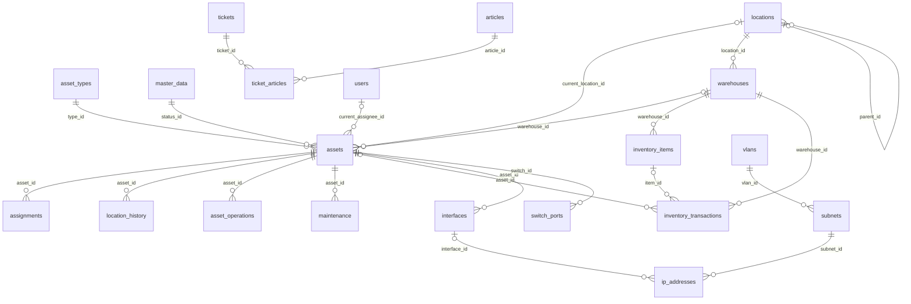

# Kiến trúc dữ liệu IT Helpdesk

Xuất lúc **2026-09-27T10:39:13+07:00**. Đối chiếu SQLAlchemy models trong working tree với database đang chạy, migration **0008**, engine **sqlite**. Đây là bản xuất cấu trúc, không chứa bản ghi nghiệp vụ, mật khẩu hoặc thông tin kết nối.

## Tổng quan

- **24 bảng nghiệp vụ/hệ thống**, cộng bảng quản lý phiên bản `alembic_version`.
- Frontend React/TypeScript → FastAPI → service nghiệp vụ → SQLAlchemy → database. Database đang dùng là SQLite; cấu hình triển khai Docker Compose dùng PostgreSQL 16.
- `assets` giữ trạng thái hiện tại; lịch sử được lưu riêng trong `asset_operations`, `assignments`, `location_history`, `maintenance`, `inventory_transactions` và `audit_logs`.
- Phần lớn bảng có `id`, `created_at`, `updated_at`, `archived`. `audit_logs` và `counters` không dùng đầy đủ nhóm cột chung này. `archived` là cơ chế ẩn/lưu trữ mềm; không đồng nghĩa tài sản đã thanh lý.
- Schema còn các bảng Ticket/API kế thừa dù giao diện Ticket đã bỏ khỏi điều hướng chính.

## Sơ đồ quan hệ chính

Sơ đồ dưới đây rút gọn các quan hệ nghiệp vụ; file `erd.mmd` chứa đầy đủ trường và khóa ngoại.

## Phân nhóm bảng

| Bảng | Vai trò |
| --- | --- |
| `articles` | Bài kiến thức, hướng xử lý và người viết. |
| `asset_operations` | Lịch sử nghiệp vụ tài sản với JSON trước/sau, thời gian và người thực hiện. |
| `asset_types` | Loại tài sản và các cờ cho phép cấp phát, vị trí, mạng, bảo trì. |
| `assets` | Hồ sơ thiết bị có serial và trạng thái/vị trí/người phụ trách hiện tại. |
| `assignments` | Lịch sử cấp phát; returned_at rỗng nghĩa là đang cấp phát. |
| `attachments` | Metadata tệp đính kèm ticket; nội dung tệp lưu trên filesystem. |
| `audit_logs` | Nhật ký kỹ thuật: đối tượng, hành động, người thao tác và JSON giá trị cũ/mới. |
| `counters` | Bộ đếm sinh số chứng từ theo tiền tố/năm. |
| `interfaces` | Giao diện mạng của tài sản, MAC duy nhất. |
| `inventory_items` | Vật tư quản lý theo số lượng, đơn vị và kho. |
| `inventory_transactions` | Chứng từ nhập/xuất cho tài sản hoặc vật tư, kho và người/trạm nhận. |
| `ip_addresses` | Địa chỉ IP trong subnet, có thể gắn giao diện mạng. |
| `location_history` | Lịch sử vị trí; ended_at rỗng nghĩa là vị trí hiện tại. |
| `locations` | Cây vị trí site → team → station; tự liên kết qua parent_id. |
| `maintenance` | Phiếu bảo trì/sửa chữa; lưu lỗi, chẩn đoán, cách xử lý, linh kiện, kết quả và chi phí. |
| `master_data` | Danh mục dùng chung: trạng thái, loại bảo trì, mức ưu tiên và các nhóm khác. |
| `subnets` | Dải IP thuộc VLAN và cơ sở. |
| `switch_ports` | Cổng switch, VLAN và tài sản kết nối. |
| `ticket_activities` | Trao đổi và hoạt động xử lý phiếu hỗ trợ. |
| `ticket_articles` | Bảng nối nhiều-nhiều giữa phiếu hỗ trợ và bài kiến thức. |
| `tickets` | Phiếu hỗ trợ; model/API còn tồn tại dù module Ticket không còn trong UI chính. |
| `users` | Người dùng, vai trò và người thực hiện thao tác. |
| `vlans` | VLAN theo cơ sở; tag duy nhất trong cùng site. |
| `warehouses` | Kho tiếp nhận, liên kết tới một vị trí. |

## Trạng thái, lịch sử và nguồn dữ liệu

`assets.current_status` là trạng thái vận hành chuẩn; `assets.status_id` trỏ tới `master_data` nhóm `asset_status` và được service đồng bộ để tương thích các bộ lọc. Nhãn tiếng Việt chỉ dùng hiển thị, API vẫn sử dụng mã hoặc ID.

| Trạng thái | Nhãn | Chuyển tiếp qua nghiệp vụ |
| --- | --- | --- |
| `AVAILABLE` | Sẵn sàng | IN_USE, MAINTENANCE, RETIRED |
| `IN_USE` | Đang sử dụng | AVAILABLE, MAINTENANCE, RETIRED |
| `MAINTENANCE` | Đang bảo trì | AVAILABLE, IN_USE, RETIRED |
| `RETIRED` | Hư / Ngừng sử dụng | DISPOSED |
| `DISPOSED` | Đã thanh lý | Kết thúc vòng đời |

Các mũi tên bao gồm những luồng tương thích hiện có: thu hồi về AVAILABLE, bảo trì và ngừng sử dụng từ AVAILABLE. API không cho PATCH trực tiếp trạng thái của tài sản đã tồn tại. Tạo hồ sơ được chọn một trong năm trạng thái, mặc định AVAILABLE.

- **Cấp phát/xuất kho:** đồng bộ Asset, Assignment nếu có người nhận, LocationHistory nếu có vị trí, InventoryTransaction và sự kiện ISSUED.
- **Thu hồi:** kết thúc Assignment, nhập kho, cập nhật vị trí/trạng thái, ghi InventoryTransaction và RETURNED trong cùng transaction. RETURN về AVAILABLE cũng kết thúc phiếu xử lý đang mở; snapshot phiếu nằm trong cùng sự kiện. Chọn AVAILABLE, MAINTENANCE hoặc RETIRED.
- **Bảo trì:** `maintenance` lưu lỗi, chẩn đoán, cách xử lý, linh kiện, chi phí; `type_id` được tái sử dụng cho nhóm vấn đề; không có Ticket FK. Tạo vấn đề không tự đổi Asset Status. `previous_status_id` ghi trạng thái trước thao tác dừng thiết bị; hoàn tất phiếu đang mở có thể khôi phục trạng thái vận hành, hủy không tự khôi phục. Trạng thái Asset không mô tả lỗi cụ thể.
- **Ngừng sử dụng:** đóng cấp phát và phiếu bảo trì mở, cập nhật Asset, ghi RETIRED. **Thanh lý:** chỉ RETIRED → DISPOSED, ghi sự kiện DISPOSED.
- **Asset History:** `asset_operations.before_state` / `after_state` là snapshot JSON; `operation_date` và `performed_by` ghi thời gian/người thực hiện. Một thao tác ghi một sự kiện nghiệp vụ; không tạo thêm STATUS_CHANGED trùng lặp.
- **Audit:** `audit_logs` ghi thay đổi kỹ thuật cũ/mới. Đây là nhật ký khác với lịch sử nghiệp vụ hiển thị cho người dùng.

## Quan hệ logic không phải khóa ngoại

- `asset_operations.from_entity_type/id`, `to_entity_type/id`: tham chiếu đa hình tới USER, LOCATION, WAREHOUSE… ID không có FK vật lý.
- `audit_logs.object_type/object_id`: tham chiếu đa hình tới đối tượng được audit, không có FK tới từng bảng.
- `switch_ports.tagged_vlans`: mảng JSON chứa ID VLAN; không phải bảng nối hay FK SQL, service kiểm tra giá trị.
- Snapshot JSON trong AssetOperation/AuditLog không có FK. `source_ref` là mã đối chiếu/khử trùng sự kiện, không phải FK.
- `assets.photo`, `locations.photo`, `attachments.storage_key` trỏ tới tệp trên filesystem theo UPLOAD_DIR. Database lưu metadata/đường dẫn, không lưu binary ảnh/tệp.

## Ràng buộc và giao dịch

- Unique: mã/serial Asset, username, mã kho/vật tư/chứng từ, MAC, IP, subnet và các cặp khóa danh mục/cổng/VLAN. Danh sách đầy đủ nằm trong schema.json và workbook.
- Partial unique index `uq_active_assignment`: mỗi Asset tối đa một Assignment có returned_at NULL. `uq_current_location`: tối đa một LocationHistory có ended_at NULL.
- Model có CHECK giới hạn 5 trạng thái. SQLite nâng cấp đang dùng trigger tương đương từ migration 0007, tránh rebuild bảng assets được nhiều FK tham chiếu.
- Kiểm tra nhóm của master_data, chuyển trạng thái, quantity dương/đủ tồn kho, chỉ một asset hoặc item trên giao dịch, cấu trúc vị trí và một phiếu bảo trì mở được thực hiện ở API/service; không nên coi tất cả là CHECK trong database.
- Service dùng transaction và khóa Asset khi thực hiện thao tác. PostgreSQL hỗ trợ khóa hàng FOR UPDATE; SQLite có cơ chế đồng thời khác, không tương đương khóa hàng PostgreSQL.
- API chặn chỉnh sửa các bảng lịch sử nghiệp vụ và audit; tính bất biến này được áp dụng ở tầng ứng dụng, không có trigger cấm mọi UPDATE/DELETE lịch sử từ SQL trực tiếp.
- Default Python/SQLAlchemy và default SQL là hai khái niệm riêng. Workbook và schema.json xuất cả hai để tránh giả định INSERT bằng SQL thuần có cùng default như ứng dụng.

## Đối chiếu model với database

Không phát hiện cột thiếu/thừa giữa model và các bảng tương ứng trong database.

Đối chiếu này không khẳng định mọi index/default có cấu trúc giống hệt ORM: các migration có server default và tên index riêng. `schema.json` ghi các constraint/index/default thực tế cùng kiểu dữ liệu/default model. `alembic_version` là bảng migration bổ sung, không phải model nghiệp vụ.

## Các file đi kèm

| File | Mục đích |
| --- | --- |
| `data-architecture.xlsx` | Mở bằng Excel: bảng, trường, FK, constraint/index và trạng thái |
| `erd.mmd` | ERD Mermaid đầy đủ, có thể import vào công cụ hỗ trợ Mermaid |
| `schema.json` | Metadata cấu trúc để tích hợp/so sánh |
| `data-dictionary.csv` | Danh sách trường, kiểu, null, key, default; UTF-8 BOM |
| `schema-sqlite.sql` | DDL thực tế gồm bảng/index/trigger, không có INSERT dữ liệu |

SQL là ảnh chụp schema SQLite hiện tại, không phải script migration PostgreSQL. Phục hồi triển khai cần Alembic và bản sao lưu dữ liệu tương ứng.

## Nguồn

- `backend/app/models.py`, `database.py`, `schemas.py`
- `backend/app/services.py`, `warehouse.py`, `asset_events.py`, `lifecycle.py`
- `backend/alembic/versions/0001` đến `0008`
- `compose.yaml`, `asset-lifecycle.md`, `docs/maintenance-flow.md`
